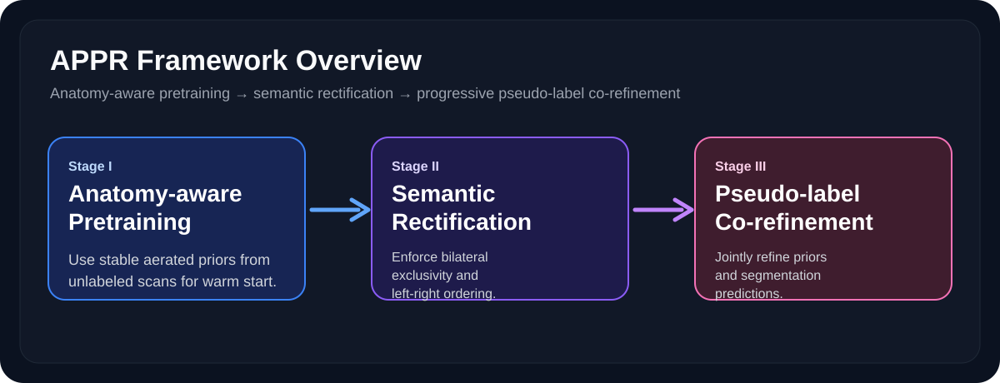
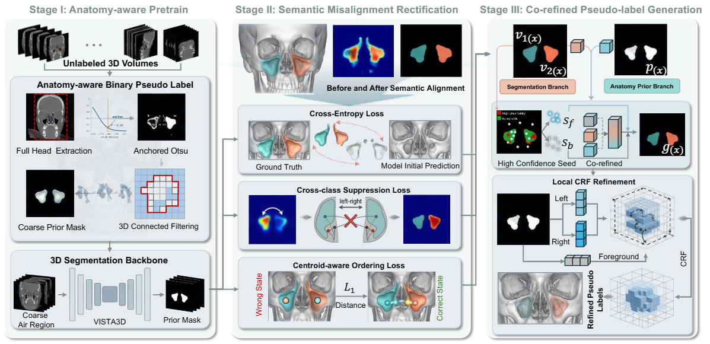
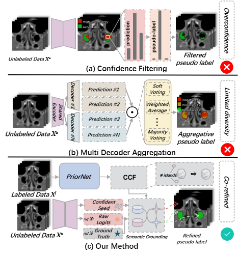
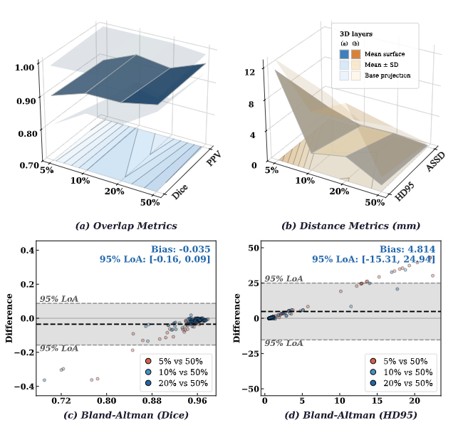
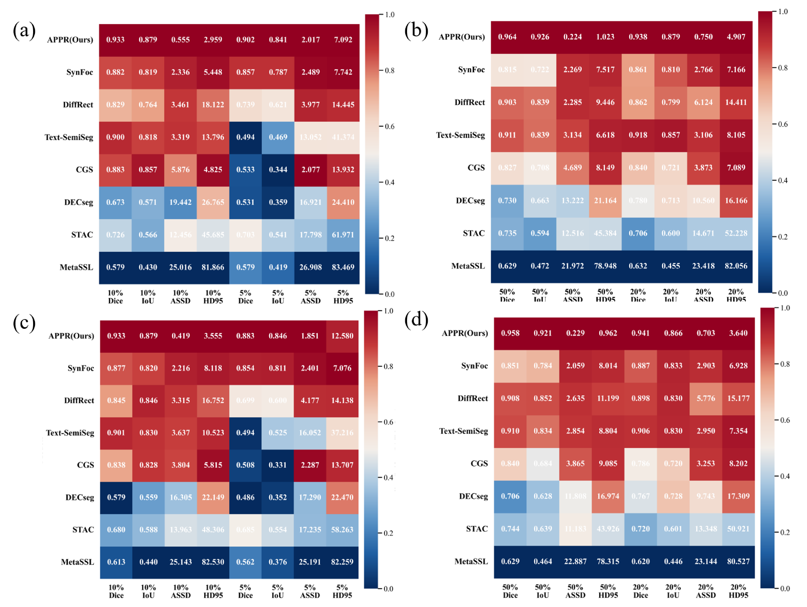

<div align="center">

# APPR

**Anatomy-aware Pretraining and Pseudo-label Rectification for Semi-Supervised Maxillary Sinus Segmentation**

Semi-Supervised Maxillary Sinus Segmentation


<!--  -->
<p align="center">
  
</p>
<p align="center"><em>Figure 1: The overall three-stage pipeline of the proposed APPR framework.</em></p>
</div>

## Overview

APPR is a three-stage semi-supervised framework designed for anatomically constrained bilateral maxillary sinus segmentation.

- **Stage I – Anatomy-aware pretraining** initializes the segmentation network with robust aerated-region priors extracted from unlabeled scans.
- **Stage II – Semantic rectification** improves labeled supervision with side-aware constraints that reduce left-right semantic confusion.
- **Stage III – Pseudo-label co-refinement** progressively fuses anatomical priors and model predictions to obtain cleaner unlabeled supervision.

This repository contains the core training, evaluation, prior modeling, loss design, and 3D backbone implementation used by APPR.

## Abstract

Semi-supervised medical image segmentation aims to leverage large volumes of unlabeled data with extremely limited annotation budgets. For anatomically complex bilateral structures, random initialization, foreground semantic misalignment, and noisy pseudo-label accumulation can significantly undermine training stability. APPR addresses this problem with a unified three-stage framework that combines anatomy-aware pretraining, semantic rectification, and progressive pseudo-label co-refinement for maxillary sinus segmentation.

## Method

APPR follows a progressive training pipeline:

1. **Anatomy-aware pretraining** extracts stable aerated-region priors from unlabeled scans to warm-start the model.
2. **Semantic rectification** imposes side-aware supervision to reduce left-right confusion and preserve bilateral exclusivity.
3. **Pseudo-label co-refinement** jointly uses prior guidance and segmentation responses to iteratively improve unlabeled supervision.

In practice, the framework is designed to improve three things at once: foreground localization, bilateral semantic consistency, and boundary quality.

<p align="center">
  
</p>
<p align="center"><em>Figure 2: Detailed illustration of the core modules in APPR.</em></p>

## Highlights

- Unified `train.py` entry for `unsup`, `sup`, and `corefined` stages.
- Explicit bilateral semantic handling for left/right maxillary sinus consistency.
- Anatomy-aware prior extraction implemented in `PriorNet.py`.
- MONAI-based 3D training and sliding-window inference pipeline.
- Lightweight evaluation entry in `eval.py` for checkpoint-based testing.

## Repository Layout

```text
APPR/
├── PriorNet.py      # anatomy-aware prior extraction and pretraining modules
├── VISTA3D.py       # 3D segmentation backbone builder
├── dataset.py       # data loading, transforms, split helpers, orientation checks
├── loss.py          # side-aware loss definitions
├── train.py         # unified three-stage training entry
├── eval.py          # checkpoint evaluation script
├── requirements.txt # minimal runtime dependencies
└── README.md
```

## Installation

```bash
python -m venv .venv
source .venv/bin/activate
pip install -r requirements.txt
```

If you are using CUDA, install the PyTorch build that matches your local driver before installing the remaining packages.

## Data Preparation

The code expects a dataset root and a split file:

```text
dataset_root/
├── images/...
├── labels/...
└── splits.json
```

Key notes:

- `dataset.py` contains orientation consistency checks to keep bilateral semantics aligned.
- `--split-json` defaults to `<dataset-root>/splits.json`.
- `--split-ratio` supports settings such as `5`, `10`, `20`, `50`, and `100`.

## Datasets

APPR is organized around two public craniofacial datasets described in the manuscript:

- **NasalSeg**: 130 craniofacial 3D CT volumes with bilateral maxillary sinus annotations.
- **ToothFairy2**: a multicenter CBCT benchmark, from which 45 maxillary-sinus-labeled cases are used in this project.

The experimental protocol uses an `8:2` train/test split and semi-supervised settings with `5%`, `10%`, `20%`, and `50%` labeled data.

## Training

### Stage I: anatomy-aware pretraining

```bash
python train.py \
  --stage unsup \
  --dataset-root /path/to/dataset_root \
  --split-ratio 20 \
  --gpu 0 \
  --amp
```

### Stage II: supervised semantic rectification

```bash
python train.py \
  --stage sup \
  --dataset-root /path/to/dataset_root \
  --split-ratio 20 \
  --init-checkpoint /path/to/stage1_checkpoint.pt \
  --gpu 0 \
  --amp
```

### Stage III: collaborative pseudo-label refinement

```bash
python train.py \
  --stage corefined \
  --dataset-root /path/to/dataset_root \
  --split-ratio 20 \
  --init-checkpoint /path/to/stage2_checkpoint.pt \
  --gpu 0 \
  --amp
```

## Evaluation

```bash
python eval.py \
  --checkpoint /path/to/checkpoint.pt \
  --dataset-root /path/to/dataset_root \
  --split-ratio 20 \
  --eval-key test \
  --gpu 0 \
  --amp
```

## Results

### Quantitative Comparison with SOTA Methods
<p align="center">
  
</p>
<p align="center"><em>Table 1: Quantitative comparison between APPR and state-of-the-art methods.</em></p>

### Qualitative Visualization Results
<p align="center">
  
</p>
<p align="center"><em>Figure 3: Qualitative visualization of maxillary sinus segmentation results.</em></p>

### Ablation Study & Heatmap Analysis
<p align="center">
  
</p>
<p align="center"><em>Figure 4: Heatmap analysis for module effectiveness validation.</em></p>

### Ablation study under 20% labeled data

| Method | Dice_fg | Left Dice | Right Dice | Mean Dice | Mean IoU | Mean PPV | Mean HD95 ↓ | Mean ASSD ↓ |
| --- | ---: | ---: | ---: | ---: | ---: | ---: | ---: | ---: |
| E1 Baseline | 0.2197 | 0.2288 | 0.2099 | 0.2194 | 0.1247 | 0.1268 | 45.0352 | 10.6486 |
| E2 S1 only | 0.6048 | - | - | - | - | - | - | - |
| E3 S2 only | 0.0782 | 0.0801 | 0.0761 | 0.0781 | 0.0409 | 0.0415 | 45.9121 | 11.2694 |
| E4 S3 only | 0.8914 | 0.8991 | 0.8816 | 0.8904 | 0.8045 | 0.9641 | 2.1667 | 0.5079 |
| E5 S1+S2 | 0.3376 | 0.4064 | 0.2441 | 0.3253 | 0.2021 | 0.7054 | 21.9025 | 6.2135 |
| E6 S1+S3 | 0.9034 | 0.9129 | 0.8806 | 0.8968 | 0.8308 | 0.9561 | 3.4096 | 1.5254 |
| E7 S2+S3 | 0.8974 | 0.9027 | 0.8810 | 0.8919 | 0.8226 | 0.9413 | 3.9960 | 2.4420 |
| **E8 Full** | **0.9258** | **0.9279** | **0.9230** | **0.9255** | **0.8624** | **0.9727** | **1.7719** | **0.4116** |

Key takeaways:

- **Stage III** is the main performance driver for structure completeness and boundary refinement.
- **Stage I** provides the strongest warm-start for stable foreground localization.
- **Full APPR** achieves the best overall accuracy and the smallest bilateral performance gap.

## Citation

If you use this repository in your work, please cite the APPR paper:

```bibtex
@article{appr2025,
  title   = {APPR: Anatomy-aware Pretraining and Pseudo-label Rectification for Semi-Supervised Maxillary Sinus Segmentation},
  author  = {Anonymous},
  journal = {Under preparation},
  year    = {2025}
}
```
